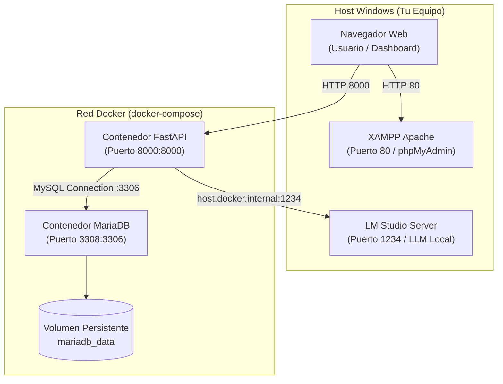

# 🚀 Guía de Despliegue con Contenedores Docker (Walkthrough)

Esta guía detalla el procedimiento paso a paso para configurar, levantar y verificar el entorno del proyecto utilizando contenedores Docker para **MariaDB** y **FastAPI**, integrados con **LM Studio** para inferencia local y **XAMPP (Apache)**.

---

## 📋 Arquitectura del Entorno



---

## 🛠️ Requisitos Previos

1. **Docker Desktop**: Debe estar abierto y en ejecución en Windows (ícono de la ballena en verde).
2. **LM Studio (Opcional para inferencia)**: Servidor local iniciado en el puerto `1234` con cualquier modelo cargado.
3. **Python 3.11+** (si deseas ejecutar scripts de migración o pruebas directamente desde tu terminal local).

---

## ⚙️ Paso 1: Configuración de Variables de Entorno (`.env`)

Asegúrate de contar con el archivo [`.env`](.env) en la raíz del proyecto (puedes basarte en [`.env.example`](.env.example)):

```env
# =================================================================
# CONFIGURACIÓN DE BASE DE DATOS (MySQL / MariaDB)
# =================================================================
# Puerto expuesto en el host para evitar colisiones con XAMPP (3306)
DB_CONTAINER_PORT=3308

# Credenciales de acceso
DB_HOST=127.0.0.1
DB_PORT=3308
DB_USER=root
DB_PASSWORD=lasalle
DB_NAME=db_sentimientos

# =================================================================
# CONFIGURACIÓN DE FASTAPI Y AUTENTICACIÓN
# =================================================================
FASTAPI_URL=http://127.0.0.1:8000
FASTAPI_USER=admin
FASTAPI_PASSWORD=12345

# =================================================================
# CONFIGURACIÓN DE INFERENCIA LM STUDIO (LLM LOCAL)
# =================================================================
LLM_BASE_URL=http://host.docker.internal:1234/v1
LLM_MODEL=
```

---

## 🚀 Paso 2: Levantar los Contenedores

Puedes elegir una de las siguientes dos modalidades según tu flujo de trabajo:

### Modalidad A: Levantar Todo con Docker Compose (Recomendado)
Levanta tanto el contenedor de MariaDB como el contenedor de la aplicación FastAPI:

```bash
docker compose up --build -d
```

> [!NOTE]
> El parámetro `-d` ejecuta los contenedores en segundo plano (modo detached), liberando tu terminal.

### Modalidad B: Levantar Solo el Contenedor de Base de Datos
Si deseas desarrollar y depurar `main.py` directamente desde tu entorno Python local mientras la base de datos corre aislada en Docker:

```bash
docker compose up -d mariadb
```

---

## 🗄️ Paso 3: Migración Inicial de Datos

Una vez que el contenedor de MariaDB esté en estado `healthy`, ejecuta la migración para crear la base de datos `db_sentimientos`, la tabla `tweets` y cargar el dataset:

### Si ejecutas desde tu máquina local (con el contenedor de BD activo en 3308):
```bash
python migrate_data.py
```

### O ejecutando la migración dentro del contenedor de FastAPI:
```bash
docker compose exec fastapi python migrate_data.py
```

**Salida esperada:**
```text
Connecting to MySQL...
Database 'db_sentimientos' checked/created.
Table 'tweets' checked/created.
Reading dataset from data/twitter_validation.csv...
Found 1000 rows. Inserting into MySQL...
Successfully migrated 1000 records to MySQL database!
```

---

## 🔍 Paso 4: Verificación del Estado y Salud

### 1. Verificar estado de los contenedores
```bash
docker compose ps
```
Deberías ver ambos contenedores en estado `Up (healthy)`.

### 2. Verificar el Health Check de FastAPI
```bash
curl http://localhost:8000/health
```
**Respuesta:**
```json
{"status": "ok", "service": "construccion-fastapi"}
```

### 3. Abrir la Aplicación en el Navegador
* **Dashboard / Login**: [http://localhost:8000/login](http://localhost:8000/login)
  * **Usuario**: `admin`
  * **Contraseña**: `12345`
* **Swagger Docs**: [http://localhost:8000/docs](http://localhost:8000/docs)
* **phpMyAdmin (XAMPP Apache)**: [http://localhost/phpmyadmin/](http://localhost/phpmyadmin/)

---

## 🛑 Paso 5: Comandos Útiles de Mantenimiento

| Acción | Comando |
|---|---|
| **Ver logs en tiempo real** | `docker compose logs -f` |
| **Ver logs solo de la base de datos** | `docker compose logs -f mariadb` |
| **Reiniciar servicios** | `docker compose restart` |
| **Detener contenedores sin borrar datos** | `docker compose stop` |
| **Detener y eliminar contenedores** | `docker compose down` |
| **Eliminar contenedores y volúmenes de datos** | `docker compose down -v` |
